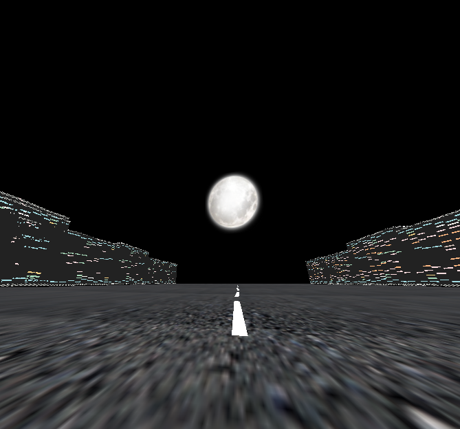

# A Train Trip

[Watch here. Click anywhere to play/pause](http://ycjungsubhuman.github.io/TrainMusicVideo/)

A web music video built ThreeJS.

Built by me, 박준수, 오윤이, 고병현.

## Discussion

The goal of this project is to create a music video by linking audio and visual events with MIDI notes. The visual events are all procedural, and programmed with code.

This was my first try at JavaScript, so the project configuration is a little clunky.
